When I joined the company, I was tasked with building a [payment system](https://en.wikipedia.org/wiki/E-commerce_payment_system) from the ground up 💳 — and from day one, the specs were clear: we were selling [B2B](https://en.wikipedia.org/wiki/Business-to-business) plans, meaning real money from real businesses was on the line. We're talking plans that can go well over **€10,000 for a single monthly payment** — not the kind of transaction you want quietly dropping into the void. Every time a card payment was validated, an [event](<https://en.wikipedia.org/wiki/Event_(computing)>) needed to reach its destination — **no exceptions**. A single missed event could mean a lost invoice, an unpaid subscription, or a client questioning where their money went. And as you can imagine, when there's money flowing, events tend to pile up fast. Delivering these events couldn't just work most of the time — it had to work **every single time**, with robust retry mechanisms that never let a failure go unhandled. So we introduced an [event bus](https://en.wikipedia.org/wiki/Message_bus) 🚌, ensuring every event was durably stored, reliably delivered, and resiliently retried on failure ⚡. This post is about that journey: how to build a scalable and robust architecture to guarantee every payment event reaches its destination, no matter what 🚀.

<!-- more -->

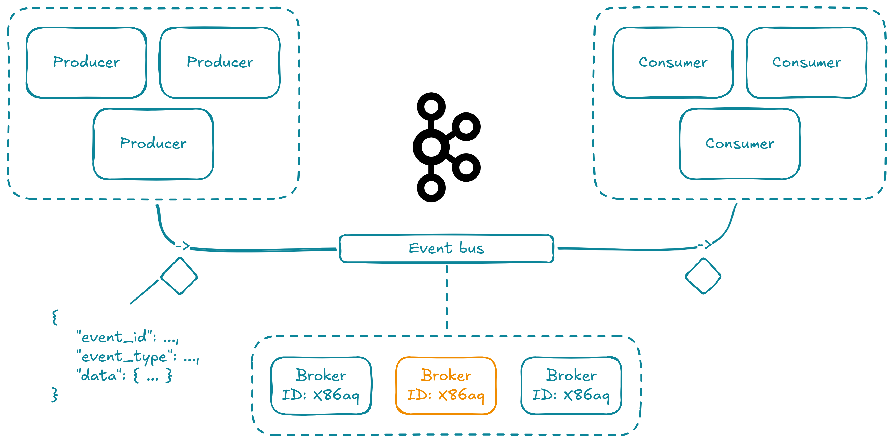

For this article, the complete code is available on GitHub 🫡 [here](https://github.com/lovindata/blog/tree/main/assets/posts/6).

## 💳 The Business Case: What Happens After the Card Is Swiped

<figure markdown="span">
  
  <figcaption>The payment flow: a user pays, Treezor validates, and our system receives the event</figcaption>
</figure>

### Treezor: Our Payment Provider

[Treezor](https://www.treezor.com/) is a [Banking-as-a-Service (BaaS)](https://en.wikipedia.org/wiki/Banking_as_a_Service) platform that handles card transactions for us 💳. When a user pays with their card at an automate — think an [SNCF](https://www.sncf.com/) ticket machine — Treezor validates the transaction and fires a [webhook](https://en.wikipedia.org/wiki/Webhook) to our system with the payment data. That's our entry point.

### What the Payment Event Looks Like

Here's what a **validated** payment event looks like when it hits our endpoint:

```json title="Payment event payload"
{
  "webhook": "cardtransaction.create",
  "webhook_id": "a1b2c3d4-e5f6-7890-abcd-ef1234567890",
  "webhook_created_at": 17310000000000,
  "object": "cardtransaction",
  "object_id": "190314",
  "object_payload": {
    "cardtransactions": [
      {
        "cardtransactionId": "700013016",
        "cardId": "1234567",
        "amount": "15.00",
        "currency": "EUR",
        "cardtransactionStatus": "VALIDATED",
        "merchantName": "SNCF Automate",
        "merchantCountry": "FR",
        "codeStatus": "170006",
        "createdDate": "2024-11-07 14:30:00"
      }
    ]
  },
  "object_payload_signature": "YmFzZTY0IGVuY29kZWQgc2lnbmF0dXJl..."
}
```

The key field here is **`cardtransactionStatus: VALIDATED`** — this means real money moved 💰. The `cardId` is also important: we'll use it later as the Kafka [message key](https://kafka.apache.org/documentation/#intro_concepts_and_terms) to ensure all transactions for the same card land in the same partition, preserving ordering.

### The Scaling Challenge

When there's just one payment, a simple `POST` handler works fine. But when **thousands of validated payments arrive per minute** — each one carrying real money, each one that **must** be processed — things get serious. You can't afford to lose a single event, and you can't afford to block the webhook response while waiting for downstream processing to complete. The [ledger](https://en.wikipedia.org/wiki/Ledger) needs to record it, [notifications](https://en.wikipedia.org/wiki/Notification_system) need to alert the right people, and analytics need to ingest it — all independently, all reliably, and all at scale ⚡. That's exactly where an event bus becomes essential.

## 🏗️ Architecture Overview

<figure markdown="span">
  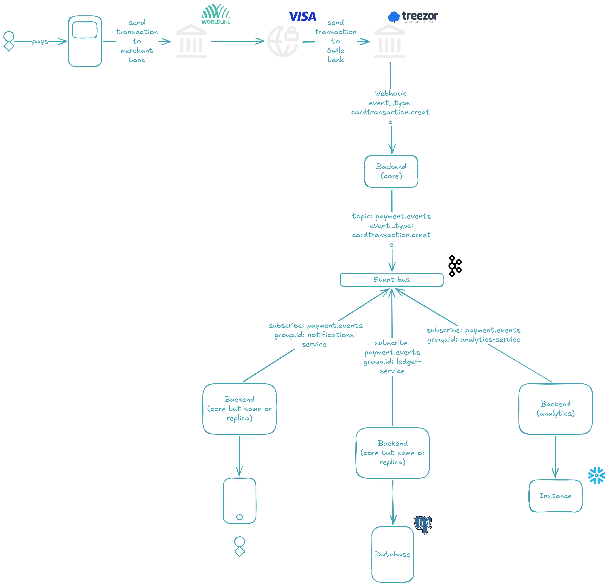
  <figcaption>The full architecture: from payment provider to Kafka to independent consumers</figcaption>
</figure>

Here's the big picture. When a [card payment is validated](https://en.wikipedia.org/wiki/E-commerce_payment_system), the payment provider fires a [webhook](https://en.wikipedia.org/wiki/Webhook) to our system. Our system validates the payload, and instead of processing the event synchronously, it **produces** it to a [Kafka](https://en.wikipedia.org/wiki/Apache_Kafka) [**topic**](https://developer.confluent.io/learn-kafka/apache-kafka/topics/) — a durable, append-only log that acts as our event bus.

Once the event lands in the topic, **three independent [consumer groups](https://docs.confluent.io/platform/current/clients/consumer.html)** 👥 pick it up and process it in parallel:

- **📒 Ledger** — records the transaction for financial accuracy
- **🔔 Notifications** — alerts the buyer about the transaction
- **📊 Analytics** — ingests the data for reporting and dashboards

Each consumer group is independent: if one fails or slows down, the others keep going. And if a consumer fails to process an event entirely, the message is redirected to a **[Dead Letter Queue](https://en.wikipedia.org/wiki/Dead_letter_queue) (DLQ)** 💀 — a separate topic where failed events can be inspected and replayed, rather than silently lost.

The key design decisions behind this architecture:

- **`cardId` as the message key** — this ensures all transactions for the same card are routed to the same [**partition**](https://kafka.apache.org/documentation/#intro_concepts_and_terms), preserving ordering per card
- **Three Kafka brokers** forming a [KRaft](https://developer.confluent.io/learn/kraft/) cluster with a **replication factor of 3** — every [**partition**](https://kafka.apache.org/documentation/#intro_concepts_and_terms) has three copies, so the cluster survives a broker failure without data loss
- **[Manual offset commit](https://docs.confluent.io/platform/current/clients/consumer.html)** — consumers only acknowledge an event after successfully processing it (or after redirecting it to the DLQ), guaranteeing [at-least-once delivery](<https://en.wikipedia.org/wiki/Reliability_(computer_networking)>)

Each of these pieces will be explored in detail in the following sections.

## 📤 The Producer: Receiving the Webhook

<figure markdown="span">
  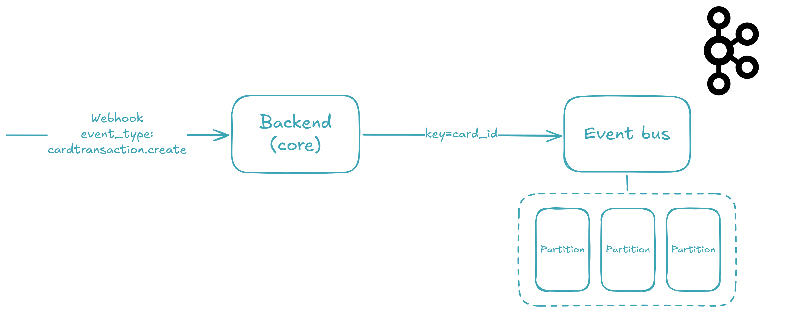
  <figcaption>The producer flow: receive, validate, extract the key, and produce</figcaption>
</figure>

When the webhook arrives, three things need to happen before the event reaches Kafka: the payload must be **validated**, the signature must be **verified**, and the `cardId` must be extracted as the message key. Let's walk through each step.

### The Webhook Model

First, we define the shape of the incoming data with [Pydantic](https://docs.pydantic.dev/) — a validation library that uses Python type annotations to parse and validate at runtime. This model mirrors exactly the JSON payload you saw earlier:

```python title="./backend_core/src/_modules/_treezor/_vos/treezor_webhook_vo.py"
from __future__ import annotations

import base64
import os
import random
import time
from typing import Any
from uuid import uuid4

from pydantic import BaseModel, Field


class TreezorWebhookVo(BaseModel):
    webhook: str = Field(
        examples=["cardtransaction.create"],
    )
    webhook_id: str = Field(
        examples=[str(uuid4())],
    )
    webhook_created_at: int = Field(
        examples=[int(time.time() * 10000)],
    )
    object: str = Field(
        examples=["cardtransaction"],
    )
    object_id: str = Field(
        examples=["190314"],
    )
    object_payload: Any = Field(
        examples=[
            {
                "cardtransactions": [
                    {
                        "cardtransactionId": "700013016",
                        "cardId": str(random.randint(1000000, 9999999)),
                        "amount": "15.00",
                        "currency": "EUR",
                        "cardtransactionStatus": "VALIDATED",
                        "merchantName": "SNCF Automate",
                        "merchantCountry": "FR",
                        "codeStatus": "170006",
                        "createdDate": "2024-11-07 14:30:00",
                    }
                ]
            }
        ],
    )
    object_payload_signature: str = Field(
        examples=[base64.b64encode(os.urandom(32)).decode()],
    )
```

Every field is declared with its Python type, and Pydantic enforces that at runtime — if the incoming payload is missing `webhook_id` or has the wrong type, the request is rejected **before** any business logic runs. The `object_payload` field uses `Any` because its structure varies depending on the event type (card transactions, transfers, chargebacks), so we defer validation to the service layer.

### The Webhook Endpoint

With the model in place, [FastAPI](https://fastapi.tiangolo.com/) gives us a zero-boilerplate endpoint by declaring a type annotation on the route parameter:

```python title="./backend_core/src/_modules/_treezor/treezor_ctrl.py"
from __future__ import annotations

from dataclasses import dataclass

from fastapi import APIRouter

from src._confs._fastapi._api.api_dependencies_ctrl import APIDependenciesCtrl
from src._modules._treezor import treezor_svc
from src._modules._treezor._vos.treezor_webhook_vo import TreezorWebhookVo


@dataclass(frozen=True)
class TreezorCtrl(APIDependenciesCtrl):
    treezor_svc: treezor_svc.TreezorSvc = treezor_svc.impl

    def set_routes(self, router: APIRouter) -> None:
        @router.post("/treezor/webhook")
        def _(treezor_webhook: TreezorWebhookVo) -> None:
            self.treezor_svc.handle_webhook(treezor_webhook)


impl = TreezorCtrl()
```

That's it. FastAPI automatically parses the incoming JSON, validates it against the `TreezorWebhookVo` model, and passes the deserialized object to the service. No manual parsing, no `try`/`except` blocks — just a typed contract between the endpoint and the service layer. The controller follows a strict separation of concerns: it defines **what** the route accepts, and delegates **how** to process it to `TreezorSvc`.

If you run the application and navigate to [http://localhost:49158/api/docs](http://localhost:49158/api/docs), you'll see the endpoint live:

<figure markdown="span">
  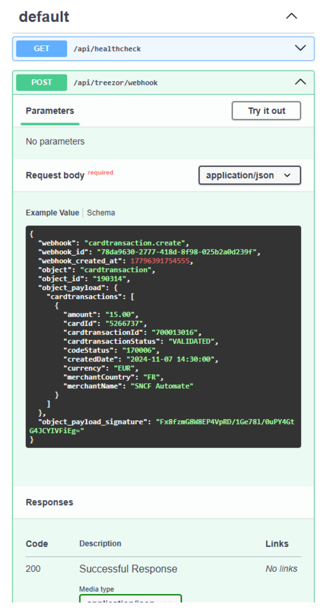
  <figcaption>The webhook endpoint in FastAPI's auto-generated SwaggerUI</figcaption>
</figure>

### Signature Validation and Key Extraction

Here's where the real work happens. The service performs two jobs: verify the signature to **prove the webhook came from Treezor**, and extract the `cardId` to use as the Kafka message key:

```python title="./backend_core/src/_modules/_treezor/treezor_svc.py"
from __future__ import annotations

from dataclasses import dataclass
from typing import Any

from loguru import logger

from src._confs._kafka import kafka_conf
from src._modules._treezor._vos.treezor_webhook_vo import TreezorWebhookVo


@dataclass(frozen=True)
class TreezorSvc:
    kafka_conf: kafka_conf.KafkaConf = kafka_conf.impl

    def handle_webhook(self, treezor_webhook: TreezorWebhookVo) -> None:
        self._validate_signature(treezor_webhook)
        key: str | None = None
        if (
            (
                cardtransactions := treezor_webhook.object_payload.get(
                    "cardtransactions", []
                )
            )
            and cardtransactions
            and (cardtransaction := cardtransactions[0])
            and isinstance(cardtransaction, dict)
            and (card_id := cardtransaction.get("cardId"))
            and isinstance(card_id, str)
        ):
            key = card_id
        self.kafka_conf.produce(
            "payment.events",
            treezor_webhook.model_dump(),
            key=key,
        )

    def _validate_signature(self, treezor_webhook: TreezorWebhookVo) -> None:
        # Validation
        # ...
        logger.info(
            "Signature validated for webhook_id={} event={} object_id={}",
            treezor_webhook.webhook_id,
            treezor_webhook.webhook,
            treezor_webhook.object_id,
        )


impl = TreezorSvc()
```

The **`_validate_signature`** method verifies the `object_payload_signature` field against the actual payload body using Treezor's shared secret — if it doesn't match, the event is rejected immediately and the webhook caller gets an HTTP error. Signature validation is your first line of defense against spoofed events.

The `cardId` extraction uses the [walrus operator](https://docs.python.org/3/reference/expressions.html#assignment-expressions) (`:=`) to chain conditions defensively. Instead of nested `if` blocks that would span 20 lines, we use a single flat expression that short-circuits at the first missing value:

1. Get `cardtransactions` from the payload (defaulting to `[]` if absent)
2. Check it's non-empty
3. Take the first transaction
4. Verify it's a `dict`
5. Extract `cardId`
6. Verify it's a `str`

If any step fails — a malformed payload, a missing field — the variable simply stays `None`, and the event is produced **without a key** (meaning Kafka will round-robin it across partitions). This is deliberate: we'd rather deliver a keyless event than crash on a bad payload.

!!! tip

    In Kafka, a **message key** is an optional field that determines which [**partition**](https://kafka.apache.org/documentation/#intro_concepts_and_terms) a message is assigned to. Messages with the same key always land in the same partition — this is how we guarantee **ordering per card**. Without a key, the producer round-robins messages across all available partitions, which is fine for throughput but breaks ordering guarantees.

Once validated and keyed, the event is handed to `kafka_conf.produce()` — and that's where the magic of the event bus really begins.

!!! warning

    The `produce()` method won't actually work yet **— we haven't set up the Kafka cluster!** The _Kafka at Scale_ section will cover the 3-node [KRaft](https://developer.confluent.io/learn/kraft/) setup with [Docker Compose](https://docs.docker.com/compose/).

### Producing to Kafka

The `KafkaConf` class wraps the [`confluent_kafka`](https://docs.confluent.io/platform/current/clients/confluent-kafka-python/html/index.html) Python client. Here are the relevant producer pieces:

```python title="./backend_core/src/_confs/_kafka/kafka_conf.py"
import json
from dataclasses import dataclass
from functools import cached_property

from confluent_kafka import KafkaError, Message, Producer
from loguru import logger

from src._confs._envs import envs_conf
from src._confs._kafka._vos import group_id_vo, key_vo, topic_vo, value_vo


@dataclass(frozen=True)
class KafkaConf:
    envs_conf: envs_conf.EnvsConf = envs_conf.impl

    def produce(
        self,
        topic: topic_vo.TopicVo,
        value: value_vo.ValueVo,
        key: key_vo.KeyVo = None,
    ) -> None:
        self._main_producer.produce(
            topic,
            key=key.encode("utf-8") if key else None,
            value=json.dumps(value).encode("utf-8"),
            callback=self._produce_callback,
        )
        self._main_producer.flush()

    @cached_property
    def _main_producer(self) -> Producer:
        return self._create_producer()

    @cached_property
    def _kafka_bootstrap_servers(self) -> str:
        return ",".join(
            [
                f"{self.envs_conf.kafka_1_host}:{self.envs_conf.kafka_1_plaintext_port}",
                f"{self.envs_conf.kafka_2_host}:{self.envs_conf.kafka_2_plaintext_port}",
                f"{self.envs_conf.kafka_3_host}:{self.envs_conf.kafka_3_plaintext_port}",
            ]
        )

    def _create_producer(self) -> Producer:
        return Producer(
            {
                "bootstrap.servers": self._kafka_bootstrap_servers,
                "security.protocol": "PLAINTEXT",
            }
        )

    def _produce_callback(
        self,
        kafka_error: KafkaError | None,
        message: Message,
    ) -> None:
        if kafka_error:
            logger.error("Failed to push to topic={}: {}", message.topic(), kafka_error)
        else:
            logger.info(
                "Successfully pushed to topic={} (partition={}, offset={}).",
                message.topic(),
                message.partition(),
                message.offset(),
            )
```

A few things to notice:

- **Serialization** — the event dict is serialized to JSON (`json.dumps`) and then encoded to UTF-8 bytes. Kafka doesn't care about schema; it just sees bytes. The `key` is also UTF-8 encoded, but only if it's not `None`.
- **Bootstrap servers** — three brokers are resolved from environment variables and passed as a comma-separated string. This is the entry point for the producer to discover the full cluster.

!!! tip

    **Bootstrap servers** are the producer's initial contact points with the Kafka cluster. The producer connects to one (any one) of them, fetches cluster metadata — broker IDs, topic partitions, leader assignments — then uses that metadata to route messages directly to the correct broker. It does **not** need to know every broker upfront; discovering three is enough to find the entire cluster.

- **Callback-driven acknowledgment** — after the broker receives the message, it invokes `_produce_callback` with either an error or a success (including the partition and offset). This is how we **know** an event reached Kafka.
- **`flush()`** — after producing, we flush the producer's internal buffer to ensure the message is actually sent before the webhook handler returns. This is a synchronous guarantee: if `flush()` succeeds, the event is on the broker.

!!! tip

    The Kafka producer doesn't send messages one by one — it **buffers** them internally and sends them in batches for throughput. Calling `flush()` forces all buffered messages to be sent before the call returns. Without it, the webhook handler could return `200 OK` while messages are still sitting in the producer's internal buffer — and if the process crashes before they're sent, those events are lost.

The full `KafkaConf` class — including the consumer-side logic we'll explore next — is available on GitHub 🫡 [here](https://github.com/lovindata/blog/tree/main/assets/posts/6/backend_core).

## ⚙️ Kafka at Scale: Brokers, Partitions, and Replication

<figure markdown="span">
  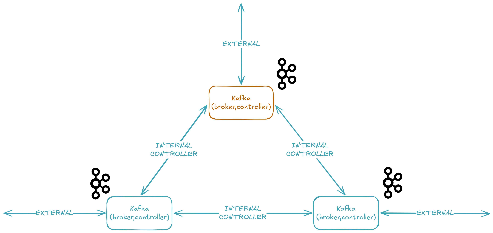
  <figcaption>A 3-node KRaft cluster: each node is both broker and controller, communicating via the INTERNAL and CONTROLLER listeners</figcaption>
</figure>

Now that we've seen how events are produced, let's set up the Kafka cluster that receives them. We're running a **3-node [KRaft](https://developer.confluent.io/learn/kraft/) cluster** 🔧 — meaning **no ZooKeeper** — where each node acts as both broker and controller. Here's the full [Docker Compose](https://docs.docker.com/compose/) configuration.

### The KRaft Cluster: No ZooKeeper

```yaml title="./devops/dev/docker-compose.yml"
services:
  kafka-1:
    image: confluentinc/cp-kafka:8.2.1
    ports:
      - "${KAFKA_1_PLAINTEXT_PORT}:9094"
    environment:
      KAFKA_KRAFT_CLUSTER_ID: "${KAFKA_KRAFT_CLUSTER_ID}"
      KAFKA_NODE_ID: "1"
      KAFKA_PROCESS_ROLES: "broker,controller"
      KAFKA_CONTROLLER_QUORUM_VOTERS: "1@kafka-1:9093,2@kafka-2:9093,3@kafka-3:9093"
      KAFKA_CONTROLLER_LISTENER_NAMES: "CONTROLLER"
      KAFKA_LISTENERS: "INTERNAL://0.0.0.0:9092,EXTERNAL://0.0.0.0:9094,CONTROLLER://0.0.0.0:9093"
      KAFKA_ADVERTISED_LISTENERS: "INTERNAL://kafka-1:9092,EXTERNAL://${KAFKA_1_HOST}:${KAFKA_1_PLAINTEXT_PORT}"
      KAFKA_LISTENER_SECURITY_PROTOCOL_MAP: "INTERNAL:PLAINTEXT,EXTERNAL:PLAINTEXT,CONTROLLER:PLAINTEXT"
      KAFKA_INTER_BROKER_LISTENER_NAME: "INTERNAL"
      KAFKA_NUM_PARTITIONS: 3
      KAFKA_DEFAULT_REPLICATION_FACTOR: 3
      KAFKA_OFFSETS_TOPIC_REPLICATION_FACTOR: 3
      KAFKA_TRANSACTION_STATE_LOG_REPLICATION_FACTOR: 3
      KAFKA_TRANSACTION_STATE_LOG_MIN_ISR: 2
      KAFKA_LOG_DIRS: "/var/lib/kafka/data"
    volumes:
      - kafka-1_var_lib_kafka_data:/var/lib/kafka/data

  kafka-2:
    image: confluentinc/cp-kafka:8.2.1
    ports:
      - "${KAFKA_2_PLAINTEXT_PORT}:9094"
    environment:
      KAFKA_KRAFT_CLUSTER_ID: "${KAFKA_KRAFT_CLUSTER_ID}"
      KAFKA_NODE_ID: "2"
      KAFKA_PROCESS_ROLES: "broker,controller"
      KAFKA_CONTROLLER_QUORUM_VOTERS: "1@kafka-1:9093,2@kafka-2:9093,3@kafka-3:9093"
      KAFKA_CONTROLLER_LISTENER_NAMES: "CONTROLLER"
      KAFKA_LISTENERS: "INTERNAL://0.0.0.0:9092,EXTERNAL://0.0.0.0:9094,CONTROLLER://0.0.0.0:9093"
      KAFKA_ADVERTISED_LISTENERS: "INTERNAL://kafka-2:9092,EXTERNAL://${KAFKA_2_HOST}:${KAFKA_2_PLAINTEXT_PORT}"
      KAFKA_LISTENER_SECURITY_PROTOCOL_MAP: "INTERNAL:PLAINTEXT,EXTERNAL:PLAINTEXT,CONTROLLER:PLAINTEXT"
      KAFKA_INTER_BROKER_LISTENER_NAME: "INTERNAL"
      KAFKA_DEFAULT_REPLICATION_FACTOR: 3
      KAFKA_NUM_PARTITIONS: 3
      KAFKA_OFFSETS_TOPIC_REPLICATION_FACTOR: 3
      KAFKA_TRANSACTION_STATE_LOG_REPLICATION_FACTOR: 3
      KAFKA_TRANSACTION_STATE_LOG_MIN_ISR: 2
      KAFKA_LOG_DIRS: "/var/lib/kafka/data"
    volumes:
      - kafka-2_var_lib_kafka_data:/var/lib/kafka/data

  kafka-3:
    image: confluentinc/cp-kafka:8.2.1
    ports:
      - "${KAFKA_3_PLAINTEXT_PORT}:9094"
    environment:
      KAFKA_KRAFT_CLUSTER_ID: "${KAFKA_KRAFT_CLUSTER_ID}"
      KAFKA_NODE_ID: "3"
      KAFKA_PROCESS_ROLES: "broker,controller"
      KAFKA_CONTROLLER_QUORUM_VOTERS: "1@kafka-1:9093,2@kafka-2:9093,3@kafka-3:9093"
      KAFKA_CONTROLLER_LISTENER_NAMES: "CONTROLLER"
      KAFKA_LISTENERS: "INTERNAL://0.0.0.0:9092,EXTERNAL://0.0.0.0:9094,CONTROLLER://0.0.0.0:9093"
      KAFKA_ADVERTISED_LISTENERS: "INTERNAL://kafka-3:9092,EXTERNAL://${KAFKA_3_HOST}:${KAFKA_3_PLAINTEXT_PORT}"
      KAFKA_LISTENER_SECURITY_PROTOCOL_MAP: "INTERNAL:PLAINTEXT,EXTERNAL:PLAINTEXT,CONTROLLER:PLAINTEXT"
      KAFKA_INTER_BROKER_LISTENER_NAME: "INTERNAL"
      KAFKA_DEFAULT_REPLICATION_FACTOR: 3
      KAFKA_NUM_PARTITIONS: 3
      KAFKA_OFFSETS_TOPIC_REPLICATION_FACTOR: 3
      KAFKA_TRANSACTION_STATE_LOG_REPLICATION_FACTOR: 3
      KAFKA_TRANSACTION_STATE_LOG_MIN_ISR: 2
      KAFKA_LOG_DIRS: "/var/lib/kafka/data"
    volumes:
      - kafka-3_var_lib_kafka_data:/var/lib/kafka/data

  akhq:
    image: tchiotludo/akhq:0.27.1
    ports:
      - "${AKHQ_PORT}:8080"
    environment:
      AKHQ_CONFIGURATION: |
        akhq:
          connections:
            docker-kafka-server:
              properties:
                bootstrap.servers: "kafka-1:9092,kafka-2:9092,kafka-3:9092"
    depends_on:
      - kafka-1
      - kafka-2
      - kafka-3

volumes:
  kafka-1_var_lib_kafka_data:
    driver: local
  kafka-2_var_lib_kafka_data:
    driver: local
  kafka-3_var_lib_kafka_data:
    driver: local
```

That's a lot of configuration, so let's break it down. But first, the environment variables:

```properties title="./devops/dev/.env.example"
# docker-compose.yml
COMPOSE_PROJECT_NAME=lovindata_github_io_event_bus-dev

AKHQ_PORT=49160

KAFKA_KRAFT_CLUSTER_ID=MkU3YTBiN2RmYWZkMzQ1Yi00YmU2LTQwODktODdlNy00Njg1YjI5Njg3YjE
KAFKA_1_HOST=localhost
KAFKA_1_PLAINTEXT_PORT=49161
KAFKA_2_HOST=localhost
KAFKA_2_PLAINTEXT_PORT=49162
KAFKA_3_HOST=localhost
KAFKA_3_PLAINTEXT_PORT=49163
```

The `.env` file is excluded from Git (see `.gitignore`), so `.env.example` serves as the template — copy it to `.env` and customize as needed.

### Understanding the Configuration

**`KAFKA_PROCESS_ROLES: "broker,controller"`** — This is the defining characteristic of [KRaft](https://developer.confluent.io/learn/kraft/) mode. Each node runs **both** the broker role (storing data 📦, serving clients) and the controller role (managing metadata 🧠, electing leaders). In older Kafka versions, you'd need a separate [ZooKeeper](https://zookeeper.apache.org/) ensemble for metadata — now the controllers themselves form a Raft quorum.

!!! tip

    Before KRaft, Kafka required a separate **ZooKeeper** cluster to store metadata like topic configurations, partition leadership, and ACLs. KRaft (introduced in [KIP-500](https://cwiki.apache.org/confluence/display/KAFKA/KIP-500%3A+Replace+ZooKeeper+with+a+Self-Managed+Metadata+Quorum)) eliminates ZooKeeper entirely by embedding a Raft-based consensus protocol directly into Kafka. The result: **simpler deployment, faster controller failover, and a single security model**. KRaft mode is production-ready for new clusters as of Kafka 3.3.

**`KAFKA_KRAFT_CLUSTER_ID`** — A unique, Base64-encoded UUID that identifies the cluster. **All three nodes must share the same cluster ID** — this is how they know they belong to the same cluster.

**`KAFKA_CONTROLLER_QUORUM_VOTERS: "1@kafka-1:9093,2@kafka-2:9093,3@kafka-3:9093"`** — The list of controller nodes that form the metadata quorum. This is the KRaft equivalent of the old ZooKeeper connect string. Each entry is `node_id@host:port`, using the CONTROLLER listener on port 9093.

**`KAFKA_LISTENERS`** and **`KAFKA_ADVERTISED_LISTENERS`** — Each broker exposes three listeners:

| Listener     | Port | Purpose                                               |
| ------------ | ---- | ----------------------------------------------------- |
| `CONTROLLER` | 9093 | KRaft controller communication between nodes          |
| `INTERNAL`   | 9092 | Inter-broker traffic within the Docker network        |
| `EXTERNAL`   | 9094 | Client connections from outside Docker (host machine) |

!!! tip

    **Advertised listeners** are what brokers **tell clients** to connect to. If a broker advertises `EXTERNAL://localhost:49161`, then when a producer or consumer fetches metadata, the broker says "connect to me at `localhost:49161`". If you get this wrong, clients can't reach the broker even if the connection to the initial bootstrap server succeeded. This is one of the most common Kafka networking pitfalls.

**`KAFKA_INTER_BROKER_LISTENER_NAME: "INTERNAL"`** — When brokers need to talk to each other (replicating data, coordinating leadership), they use the INTERNAL listener on port 9092. This keeps inter-broker traffic inside the Docker network, avoiding the host's port mapping.

**`KAFKA_NUM_PARTITIONS: 3`** — When a new topic is created without specifying the partition count, it defaults to 3. We chose 3 because we have 3 brokers — this spreads data evenly across the cluster.

!!! tip

    A [**partition**](https://kafka.apache.org/documentation/#intro_concepts_and_terms) is the unit of parallelism in Kafka. Each topic is split into partitions, and each partition lives on one broker (with replicas on others). More partitions means more parallel consumers, but also more overhead. The sweet spot for a 3-broker cluster is typically 3 partitions per topic — one per broker.

**`KAFKA_DEFAULT_REPLICATION_FACTOR: 3`** — Every partition is replicated 3 times: one leader and two followers. If a broker goes down, the remaining two still hold a complete copy of the data 🛡️.

!!! tip

    The **replication factor** determines how many copies of each partition exist across the cluster. A replication factor of 3 means each partition has one leader and two followers on different brokers. This is what allows Kafka to survive a broker failure **without data loss** — any two brokers can fail, and the data is still available on the remaining one.

**`KAFKA_OFFSETS_TOPIC_REPLICATION_FACTOR: 3`** and **`KAFKA_TRANSACTION_STATE_LOG_REPLICATION_FACTOR: 3`** — These are special internal topics that Kafka creates automatically. The consumer offsets topic stores which messages each consumer group has processed, and the transaction log supports exactly-once semantics. Both default to the cluster's replication factor here.

**`KAFKA_TRANSACTION_STATE_LOG_MIN_ISR: 2`** — The minimum number of in-sync replicas (ISR) that must acknowledge a write before it's considered committed.

!!! tip

    **Min ISR** (in-sync replicas) is the minimum number of replicas that must be caught up and available for a partition to accept writes. With `min.insync.replicas=2` and a replication factor of 3, writes succeed as long as **at least 2 out of 3** brokers acknowledge them. This means you can tolerate 1 broker failure without losing availability — but you also can't write if 2 brokers go down, because the ISR would drop below 2. It's a trade-off between **durability** (more replicas verify the write) and **availability** (fewer failures are tolerated).

Each broker also persists data to a Docker volume (`kafka-{1,2,3}_var_lib_kafka_data`), so data survives container restarts.

### AKHQ: Visualizing the Cluster

[AKHQ](https://akhq.io/) (formerly KafkaHQ) is a web UI for managing and monitoring Kafka clusters. Our Compose file includes it as a fourth service, connecting to the three brokers via their INTERNAL listener:

```yaml
akhq:
  image: tchiotludo/akhq:0.27.1
  ports:
    - "${AKHQ_PORT}:8080"
  environment:
    AKHQ_CONFIGURATION: |
      akhq:
        connections:
          docker-kafka-server:
            properties:
              bootstrap.servers: "kafka-1:9092,kafka-2:9092,kafka-3:9092"
  depends_on:
    - kafka-1
    - kafka-2
    - kafka-3
```

Note that AKHQ uses the `INTERNAL` listener (`kafka-1:9092`) because it runs inside the Docker network — it doesn't need the `EXTERNAL` one. This is a clean separation: external clients use port 49161-49163, internal services use port 9092.

Once the cluster is running, AKHQ will be available at [http://localhost:49160](http://localhost:49160). You'll be able to see all topics, consumer groups, and browse messages directly from the browser:

<figure markdown="span">
  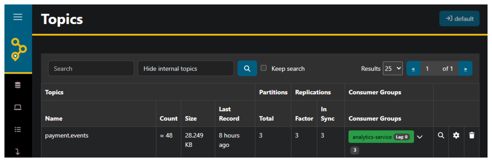
  <figcaption>AKHQ displaying the <code>payment.events</code> topic with its 3 partitions and replication factor</figcaption>
</figure>

### Starting the Cluster

With the configuration in place, start the cluster 🚀:

```bash title="Start the 3-node KRaft cluster"
docker compose -f ./devops/dev/docker-compose.yml --env-file ./devops/dev/.env up -d
```

Docker Compose will pull the [`confluentinc/cp-kafka:8.2.1`](https://hub.docker.com/r/confluentinc/cp-kafka) and [`tchiotludo/akhq:0.27.1`](https://github.com/tchiotludo/akhq) images, form the KRaft quorum, and start all four services. After a few seconds:

<figure markdown="span">
  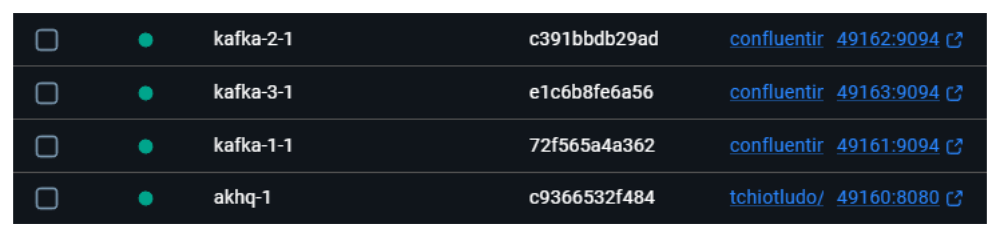
  <figcaption>The 3 Kafka brokers and AKHQ running in Docker</figcaption>
</figure>

## 📥 Consumer Groups: Processing in Parallel

<figure markdown="span">
  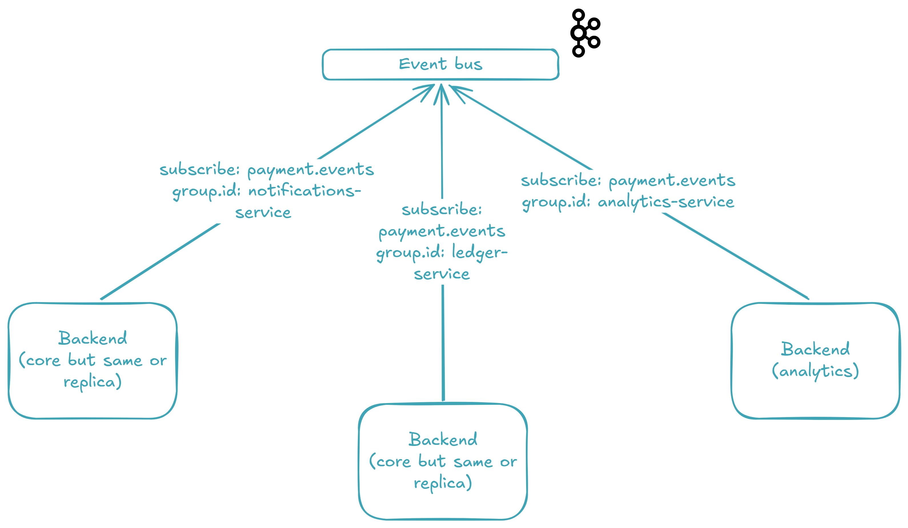
  <figcaption>Three independent consumer groups each receive every message from <code>payment.events</code></figcaption>
</figure>

Now that the cluster is running and events are flowing in, let's look at the other side of the bus 🚌 — the consumers. With Kafka, multiple **independent [consumer groups](https://docs.confluent.io/platform/current/clients/consumer.html)** 👥 can read from the same [**topic**](https://developer.confluent.io/learn-kafka/apache-kafka/topics/) simultaneously, and each group gets its own copy of every message. This is the secret sauce that lets us process a payment for the ledger, notifications, and analytics **at the same time without any coupling** between them.

### What Is a Consumer Group?

A **consumer group** is a set of consumers that **share** a topic's partitions. Within a group, each partition is assigned to exactly one consumer — so work is distributed, not duplicated. But separate groups are completely independent: group A processes every message, and group B also processes every message, each at its own pace.

In our system, we use three consumer groups — one per concern:

- **📒 Ledger** (`ledger-service`) — records the transaction
- **🔔 Notifications** (`notifications-service`) — alerts the buyer
- **📊 Analytics** (`analytics-service`) — ingests data for reporting

The ledger and notifications run inside `backend_core` (port 49158). The analytics run in `backend_analytics` (port 49159) — a completely separate codebase. Same topic, independent scaling.

!!! tip

    Think of consumer groups as independent "subscriptions" to a topic. Each group tracks its own **offset position** in the log — how far it's read — so a slow consumer group never blocks a fast one. If you spin up a second consumer in the same group, it takes over some partitions and the load splits — that's how you scale processing horizontally.

### Consuming Events: The Code

The consumer lives in `KafkaConf`, the same class that holds the producer. Here are the relevant consumer pieces:

```python title="./backend_core/src/_confs/_kafka/kafka_conf.py"
    def subscribe(
        self,
        group_id: group_id_vo.GroupIdVo,
        topic: topic_vo.TopicVo,
        handler: Callable[[value_vo.ValueVo], None],
    ) -> None:
        consumer = self._create_consumer(group_id, topic)
        try:
            dlq_topic = f"{topic}.{group_id}.dlq"
            dlq_producer = self._create_producer()
            while True:
                message = consumer.poll(timeout=1.0)
                if message is None:
                    continue
                if kafka_error := message.error():
                    logger.error(
                        "Subscriber error on topic={} group_id={}: {}",
                        topic,
                        group_id,
                        kafka_error,
                    )
                    continue
                message_value = message.value()
                if message_value is None:
                    logger.error(
                        "Subscriber received empty message on topic={} group_id={}: value={}",
                        topic,
                        group_id,
                        message_value,
                    )
                    consumer.commit(message=message)
                    continue
                try:
                    event = json.loads(message_value.decode("utf-8"))
                    handler(event)
                    consumer.commit(message=message)
                except Exception:
                    logger.exception(
                        "Subscriber failed to handle event on topic={} group_id={}. Redirecting to DLQ topic={}.",
                        topic,
                        group_id,
                        dlq_topic,
                    )
                    try:
                        dlq_producer.produce(
                            dlq_topic,
                            value=message_value,
                            callback=self._produce_callback,
                        )
                        dlq_producer.flush()
                        consumer.commit(message=message)
                    except Exception:
                        logger.exception(
                            "DLQ produce failed for topic={} group_id={}. "
                            "Offset will not be committed — message will be re-delivered on next poll.",
                            topic,
                            group_id,
                        )
        finally:
            consumer.close()

    def _create_consumer(
        self,
        group_id: group_id_vo.GroupIdVo,
        topic: topic_vo.TopicVo,
    ) -> Consumer:
        consumer = Consumer(
            {
                "bootstrap.servers": self._kafka_bootstrap_servers,
                "group.id": group_id,
                "auto.offset.reset": "earliest",
                "enable.auto.commit": False,
            }
        )
        consumer.subscribe([topic])
        logger.info(
            "Subscribed to {} (group.id={}).",
            topic,
            group_id,
        )
        return consumer
```

The loop is straightforward: **poll** for a message, **deserialize** from JSON bytes, call the **handler**, and **commit** the offset. If the handler throws, the message is redirected to a [Dead Letter Queue](https://en.wikipedia.org/wiki/Dead_letter_queue) — but we'll dive into that in the next section.

!!! tip

    `auto.offset.reset: earliest` means that when a consumer group starts **for the first time** (no committed offset), it reads from the very beginning of the topic. This is perfect for bootstrapping new services: start a new consumer group, and it replays the entire topic history. If you change it to `latest`, the new group will only see messages produced after it subscribes.

!!! tip

    `enable.auto.commit: False` is the key to **[at-least-once delivery](<https://en.wikipedia.org/wiki/Reliability_(computer_networking)>)**. The offset is committed **only after** the handler returns successfully — never before. If the consumer crashes mid-processing, the message is re-delivered on the next poll. The trade-off is that a message may be processed twice, which is why downstream systems should be idempotent.

### backend_core: Ledger and Notifications

`backend_core` starts two [daemon threads](https://docs.python.org/3/library/threading.html#threading.Thread) before firing up its FastAPI server:

```python title="./backend_core/main.py"
from threading import Thread

from loguru import logger
from watchfiles import run_process

from src._confs import loguru_conf
from src._confs._envs import envs_conf
from src._confs._fastapi import fastapi_conf
from src._confs._kafka import kafka_conf
from src._modules._ledger import ledger_svc
from src._modules._notifications import notifications_svc


def start() -> None:
    logger.info("Booting up... Getting everything ready!")
    loguru_conf.impl.set_log_level()
    Thread(
        target=kafka_conf.impl.subscribe,
        args=(
            "notifications-service",
            "payment.events",
            notifications_svc.impl.handle_payment_events,
        ),
        daemon=True,
    ).start()
    Thread(
        target=kafka_conf.impl.subscribe,
        args=(
            "ledger-service",
            "payment.events",
            ledger_svc.impl.handle_payment_events,
        ),
        daemon=True,
    ).start()
    fastapi_conf.impl.run_server()


@logger.catch
def main() -> None:
    if envs_conf.impl.watchfiles:
        run_process(
            "./src",
            "./main.py",
            envs_conf.impl.dotenv_path,
            target=start,
            args=(),
        )
    else:
        start()


if __name__ == "__main__":
    main()
```

Each `Thread` wraps a call to `kafka_conf.subscribe()` — which runs an infinite poll loop, so threads are the natural fit. The [daemon flag](https://docs.python.org/3/library/threading.html#threading.Thread.daemon) ensures they don't keep the process alive if the main thread exits.

The ledger handler is minimal: it validates the payload, extracts the transaction fields, and logs them:

```python title="./backend_core/src/_modules/_ledger/ledger_svc.py"
from __future__ import annotations

from dataclasses import dataclass

from loguru import logger

from src._confs._kafka._vos.value_vo import ValueVo
from src._modules._treezor._vos.treezor_webhook_vo import TreezorWebhookVo


@dataclass(frozen=True)
class LedgerSvc:
    def handle_payment_events(self, value: ValueVo) -> None:
        treezor_webhook = TreezorWebhookVo.model_validate(value)
        cardtransactions = treezor_webhook.object_payload.get("cardtransactions", [{}])[
            0
        ]
        # Save to ledger
        # ...
        logger.info(
            "Transaction saved to ledger: transaction_id={} amount={} {} merchant={} status={}",
            cardtransactions.get("cardtransactionId"),
            cardtransactions.get("amount"),
            cardtransactions.get("currency"),
            cardtransactions.get("merchantName"),
            cardtransactions.get("cardtransactionStatus"),
        )


impl = LedgerSvc()
```

The notifications handler is similar — but with a twist:

```python title="./backend_core/src/_modules/_notifications/notifications_svc.py"
from __future__ import annotations

import random
from dataclasses import dataclass

from loguru import logger

from src._confs._kafka._vos.value_vo import ValueVo
from src._modules._treezor._vos.treezor_webhook_vo import TreezorWebhookVo


@dataclass(frozen=True)
class NotificationsSvc:
    def handle_payment_events(self, value: ValueVo) -> None:
        # Simulation of a failure
        if random.random() < 0.1:
            raise RuntimeError("Notification delivery failed.")
        treezor_webhook = TreezorWebhookVo.model_validate(value)
        cardtransactions = treezor_webhook.object_payload.get("cardtransactions", [{}])[
            0
        ]
        # Send notifications
        # ...
        logger.info(
            "Notification sent successfully to buyer: amount={} {} at {} — {} on {}",
            cardtransactions.get("amount"),
            cardtransactions.get("currency"),
            cardtransactions.get("merchantName"),
            cardtransactions.get("cardtransactionStatus"),
            cardtransactions.get("createdDate"),
        )


impl = NotificationsSvc()
```

See the `random.random() < 0.1`? That's a **10% simulated failure rate** ⚠️. We deliberately inject failures to demonstrate what happens when a consumer can't process a message — something that will happen in production whether you like it or not (network blips, third-party API timeouts, database deadlocks). The question isn't _if_ a handler will fail, but _what the system does when it does_. That's the topic of the [Dead Letter Queue](#) section.

!!! tip

    The 10% failure simulation is **not** a production pattern — it's a development aid that lets you exercise failure handling **every time you run the system locally**. Without it, you'd need to set up complex failure scenarios (kill processes, unplug networks) just to verify your error handling works. A simple random throw keeps the failure path well-tested.

### backend_analytics: A Separate Service

`backend_analytics` is a completely independent codebase with its own `main.py`, its own FastAPI instance (port 49159), and its own consumer group definition. It subscribes a single group:

```python title="./backend_analytics/main.py"
from threading import Thread

from loguru import logger
from watchfiles import run_process

from src._confs import loguru_conf
from src._confs._envs import envs_conf
from src._confs._fastapi import fastapi_conf
from src._confs._kafka import kafka_conf
from src._modules._analytics import analytics_svc


def start() -> None:
    logger.info("Booting up... Getting everything ready!")
    loguru_conf.impl.set_log_level()
    Thread(
        target=kafka_conf.impl.subscribe,
        args=(
            "analytics-service",
            "payment.events",
            analytics_svc.impl.handle_payment_events,
        ),
        daemon=True,
    ).start()
    fastapi_conf.impl.run_server()


@logger.catch
def main() -> None:
    if envs_conf.impl.watchfiles:
        run_process(
            "./src",
            "./main.py",
            envs_conf.impl.dotenv_path,
            target=start,
            args=(),
        )
    else:
        start()


if __name__ == "__main__":
    main()
```

And its handler:

```python title="./backend_analytics/src/_modules/_analytics/analytics_svc.py"
from __future__ import annotations

from dataclasses import dataclass

from loguru import logger

from src._confs._kafka._vos.value_vo import ValueVo
from src._modules._treezor._vos.treezor_webhook_vo import TreezorWebhookVo


@dataclass(frozen=True)
class AnalyticsSvc:
    def handle_payment_events(self, value: ValueVo) -> None:
        treezor_webhook = TreezorWebhookVo.model_validate(value)
        cardtransactions = treezor_webhook.object_payload.get("cardtransactions", [{}])[
            0
        ]
        # Push to analytics service
        # ...
        logger.info(
            "Analytics event processed: transaction_id={} card_id={} amount={} {} status={}",
            cardtransactions.get("cardtransactionId"),
            cardtransactions.get("cardId"),
            cardtransactions.get("amount"),
            cardtransactions.get("currency"),
            cardtransactions.get("cardtransactionStatus"),
        )


impl = AnalyticsSvc()
```

Notice the similarity: every handler parses the event the same way, then does its own thing. That's the beauty of the event bus — each consumer group is a blank slate that receives the same data and processes it according to its own domain.

### Type-Safe Consumer Groups

The consumer group IDs are enforced at the type level through [Python `Literal` types](https://docs.python.org/3/library/typing.html#typing.Literal):

```python title="./backend_core/src/_confs/_kafka/_vos/group_id_vo.py"
from __future__ import annotations

from typing import Literal

GroupIdVo = Literal["notifications-service", "ledger-service"]
```

```python title="./backend_analytics/src/_confs/_kafka/_vos/group_id_vo.py"
from __future__ import annotations

from typing import Literal

GroupIdVo = Literal["analytics-service"]
```

This means you **can't** accidentally subscribe with a group ID that doesn't exist in your codebase — the type checker will catch it at compile time. `backend_core` can only create the `notifications-service` and `ledger-service` groups. `backend_analytics` can only create `analytics-service`. If you try to use `analytics-service` in `backend_core`, the editor will show a red squiggly line 🔴 before you even run the code.

Here's what it looks like when all three consumers process a payment event:

<figure markdown="span">
  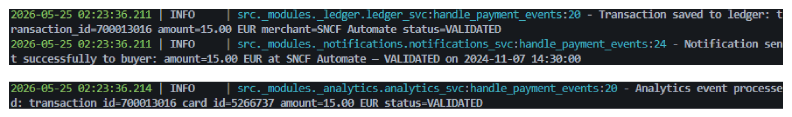
  <figcaption>Terminal logs: the producer pushes to <code>payment.events</code>, and all three consumers pick it up</figcaption>
</figure>

With the cluster running, AKHQ makes it easy to verify that all three consumer groups are consuming from `payment.events`:

<figure markdown="span">
  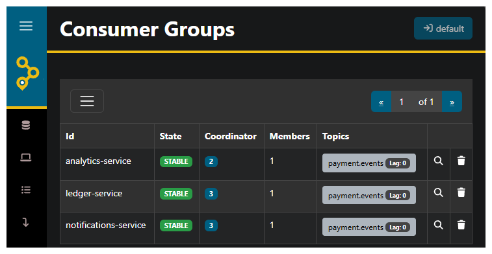
  <figcaption>AKHQ showing three consumer groups — <code>ledger-service</code>, <code>notifications-service</code>, and <code>analytics-service</code> — each consuming from <code>payment.events</code></figcaption>
</figure>

## 💀 When Things Fail: The Dead Letter Queue

In a payment system, you can't afford to lose events — but you also can't afford to crash a [consumer group](https://docs.confluent.io/platform/current/clients/consumer.html) because one message triggers a [bug](https://en.wikipedia.org/wiki/Software_bug), a [timeout](<https://en.wikipedia.org/wiki/Timeout_(computing)>), or a third-party outage. This is where the **Dead Letter Queue** comes in: instead of dropping failed messages into the void, we redirect them to a separate topic where they can be inspected, diagnosed, and replayed.

### The DLQ Pattern

The DLQ redirect is baked directly into the `subscribe()` poll loop — we've already seen the full method, but here's the critical part:

```python title="./backend_core/src/_confs/_kafka/kafka_conf.py"
                try:
                    event = json.loads(message_value.decode("utf-8"))
                    handler(event)
                    consumer.commit(message=message)
                except Exception:
                    logger.exception(
                        "Subscriber failed to handle event on topic={} group_id={}. Redirecting to DLQ topic={}.",
                        topic,
                        group_id,
                        dlq_topic,
                    )
                    try:
                        dlq_producer.produce(
                            dlq_topic,
                            value=message_value,
                            callback=self._produce_callback,
                        )
                        dlq_producer.flush()
                        consumer.commit(message=message)
                    except Exception:
                        logger.exception(
                            "DLQ produce failed for topic={} group_id={}. "
                            "Offset will not be committed — message will be re-delivered on next poll.",
                            topic,
                            group_id,
                        )
```

The decision tree is simple:

1. **Handler succeeds** → commit the offset, move on ✅
2. **Handler throws** → redirect the message to a DLQ topic, then commit the offset ✅
3. **DLQ produce also fails** → **don't** commit the offset → the message stays unacknowledged and will be **re-delivered** on the next poll 🔄

!!! tip

    A [**Dead Letter Queue**](https://en.wikipedia.org/wiki/Dead_letter_queue) (DLQ) is a dedicated topic for messages that couldn't be processed. The raw, unmodified message is preserved exactly as it arrived — so you can inspect it later, understand why it failed, fix the handler, and replay it without data loss. This is standard practice in [event-driven architectures](https://en.wikipedia.org/wiki/Event-driven_architecture) where message loss is simply not an option.

### The 10% Failure in Action

Remember the `notifications_svc.py` handler we saw earlier? Every call has a 10% chance of throwing:

```python
if random.random() < 0.1:
    raise RuntimeError("Notification delivery failed.")
```

When that happens, the event is immediately caught by the `except Exception` block in `subscribe()`, and the raw JSON bytes are produced to the DLQ topic. The offset is committed — meaning consumers **don't** get stuck retrying the same failing message over and over (a [poison pill](https://en.wikipedia.org/wiki/Poison_pill_message) loop). Instead, the message is safely parked while the consumer group keeps processing the next events.

Here's what it looks like in the terminal:

<figure markdown="span">
  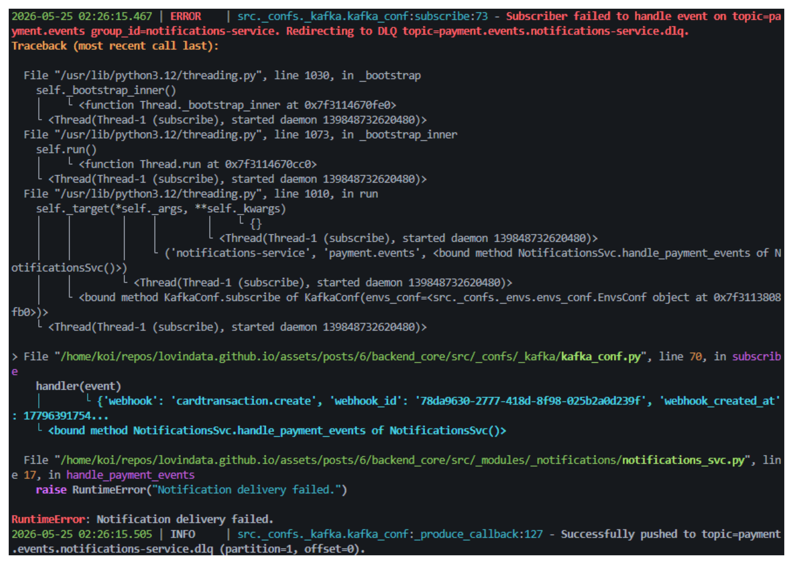
  <figcaption>A notification delivery fails, and the message is redirected to <code>payment.events.notifications-service.dlq</code></figcaption>
</figure>

### DLQ Topic Naming Convention

Each consumer group gets its own DLQ, following the pattern `{topic}.{group_id}.dlq`:

| Consumer Group          | DLQ Topic                                  |
| ----------------------- | ------------------------------------------ |
| `notifications-service` | `payment.events.notifications-service.dlq` |
| `ledger-service`        | `payment.events.ledger-service.dlq`        |
| `analytics-service`     | `payment.events.analytics-service.dlq`     |

!!! tip

    Why separate DLQ topics per consumer group? Because each consumer processes events **for a different purpose** — a notification failure isn't the same as a ledger failure. Separate DLQs let you inspect and replay failures independently: you can fix the notification handler and replay its DLQ **without touching the ledger or analytics DLQs**. This is isolation at the failure-handling level.

### Double Failure: When the DLQ Itself Fails

The nested `try` inside the first `except` handles a crucial edge case: what if producing to the DLQ topic also fails? Maybe Kafka is temporarily unreachable. In that case:

```python
logger.exception(
    "DLQ produce failed for topic={} group_id={}. "
    "Offset will not be committed — message will be re-delivered on next poll.",
    topic,
    group_id,
)
```

The offset is **not** committed. This means the consumer will poll the message again — entering a retry loop. If the DLQ becomes available again on the next cycle, the redirect succeeds. If not, the consumer keeps trying.

!!! tip

    This is **[at-least-once delivery](<https://en.wikipedia.org/wiki/Reliability_(computer_networking)>)** in its rawest form ⚡. The system would rather reprocess a message 100 times than lose it once. The trade-off is that during a DLQ outage, the consumer is effectively blocked — it will keep polling the same failing message. In production, you'd add an **exponential backoff** or a **maximum retry count** to avoid a tight loop saturating logs and CPU.

### Inspecting Failed Messages in AKHQ

Once messages land in a DLQ topic, AKHQ lets you **browse the raw payload**, inspect the headers, and replay the message back to the original topic after fixing the handler:

<figure markdown="span">
  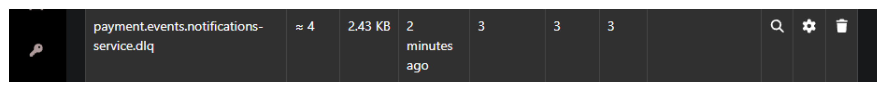
  <figcaption>AKHQ displaying the <code>payment.events.notifications-service.dlq</code> topic with messages that failed to process</figcaption>
</figure>

!!! tip

    The DLQ pattern **redirects** failed messages — it does **not** automatically replay them. Replaying DLQ messages is a deliberate, manual process: you inspect the failure in AKHQ, understand what went wrong, fix the handler, and then redirect the stored messages back to the original topic using a [Kafka console producer](https://docs.confluent.io/platform/current/clients/cli.html), a custom replay script, or a tool like [Kafka Connect](https://docs.confluent.io/platform/current/connect/). Replay is **manual by design** — a message that failed once might fail again for the same reason, so human oversight ensures you don't replay a poison pill into an infinite loop.

The entire DLQ pattern — detection, redirection, inspection, and manual replay — ensures that **no payment event is ever lost** 🫡. Failed events are transparent, traceable, and recoverable, which is the foundation of a reliable event bus 🚌.

## 🔮 What's Next

The current setup runs everything locally via [Docker Compose](https://docs.docker.com/compose/) — perfect for development and proving the architecture works. But in production, you'd deploy `backend_core` and `backend_analytics` on [Kubernetes](https://kubernetes.io/) with **multiple replicas**. That's where the **`group.id`** truly shines: if you spin up 3 pods of `backend_core` with `group.id=ledger-service`, Kafka automatically distributes the 3 partitions among them — **each pod processes its own partition in parallel**, and if one pod goes down, the others **pick up the slack** 🚀.

This article is already long enough as it is 😅, but a Kubernetes deployment with replica scaling and partition rebalancing would be a natural follow-up. I hope this deep dive into the producer, the cluster, the consumer groups, and the DLQ pattern gives you a solid foundation to build upon.

I try to write monthly on the [LovinData Blog](https://lovindata.github.io/blog/) and on [Medium](https://medium.com/@jamesjg), and like to give back the knowledge I've learned. So don't hesitate to reach out; I'm always available to chat about nerdy stuff 🤗! Here are my socials: [LinkedIn](https://www.linkedin.com/in/james-jiang-87306b155/), [Twitter](https://twitter.com/jamesjg_) and [Reddit](https://www.reddit.com/user/lovindata/). Otherwise, let's learn together in the next story 🫡! Bye ❤️.
